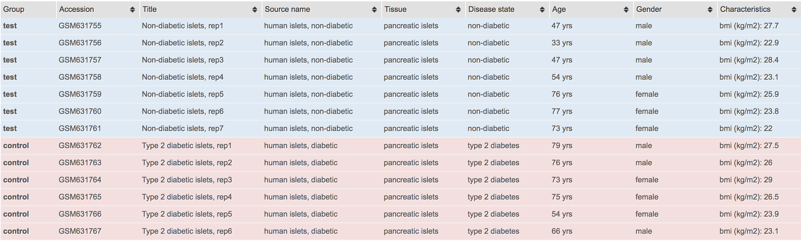
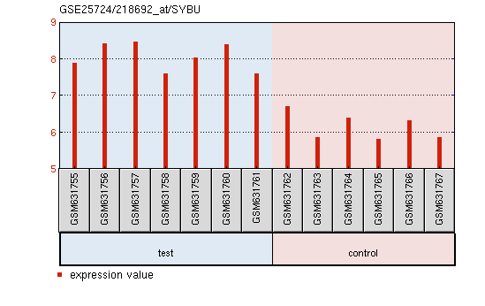
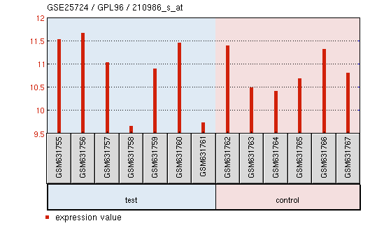

# 1. Introduction
In this study, we will perform gene expression analysis of GSE25724 dataset. The dataset contains expression data from 6 type 2 diabetic and 7 non-diabetic isolated human islets. We will investigate significant genes and Gene Ontology (GO) terms related to diabetes using GEO2R and topGO packages respectively.

# 2. Gene Expression Analysis using GEO2R
## 2.1. GEO2R Settings
We first use GEO2R to compare two groups of diabete samples in order to identify genes that are differentially expressed across experimental conditions. In this case, we select 7 non-diabetic samples as test group and other diabetic samples as control group.


By checking the box-plot of our samples (as shown below), we can confirm ourselvies that all data are median-centred and thus comparable. 
Then the testing is performed using the default setting, namely we calculate statistics including adjusted p-value, p-value, t, B and logFC. The p-value is particularly important since genes with the smallest p-values will be the most reliable.
```{r results='hide', message=FALSE, warning=FALSE}
# Version info: R 3.2.3, Biobase 2.30.0, GEOquery 2.40.0, limma 3.26.8
# R scripts generated  Tue Feb 7 18:43:49 EST 2017

################################################################
#   Differential expression analysis with limma
library(Biobase)
library(GEOquery)
library(limma)

# load series and platform data from GEO

gset <- getGEO("GSE25724", GSEMatrix =TRUE, AnnotGPL=TRUE)
if (length(gset) > 1) idx <- grep("GPL96", attr(gset, "names")) else idx <- 1
gset <- gset[[idx]]

# make proper column names to match toptable 
fvarLabels(gset) <- make.names(fvarLabels(gset))

# group names for all samples
gsms <- "0000000111111"
sml <- c()
for (i in 1:nchar(gsms)) { sml[i] <- substr(gsms,i,i) }

# log2 transform
ex <- exprs(gset)
qx <- as.numeric(quantile(ex, c(0., 0.25, 0.5, 0.75, 0.99, 1.0), na.rm=T))
LogC <- (qx[5] > 100) ||
          (qx[6]-qx[1] > 50 && qx[2] > 0) ||
          (qx[2] > 0 && qx[2] < 1 && qx[4] > 1 && qx[4] < 2)
if (LogC) { ex[which(ex <= 0)] <- NaN
  exprs(gset) <- log2(ex) }

# set up the data and proceed with analysis
sml <- paste("G", sml, sep="")    # set group names
fl <- as.factor(sml)
gset$description <- fl
design <- model.matrix(~ description + 0, gset)
colnames(design) <- levels(fl)
fit <- lmFit(gset, design)
cont.matrix <- makeContrasts(G1-G0, levels=design)
fit2 <- contrasts.fit(fit, cont.matrix)
fit2 <- eBayes(fit2, 0.01)
tT <- topTable(fit2, adjust="fdr", sort.by="B", number=round(dim(fit$genes)[1]*1))
tT <- subset(tT, select=c("ID","adj.P.Val","P.Value","t","B","logFC","Gene.symbol","Gene.title"))
gene.results<- tT

################################################################
#   Boxplot for selected GEO samples
library(Biobase)
library(GEOquery)

# load series and platform data from GEO

gset <- getGEO("GSE25724", GSEMatrix =TRUE, getGPL=FALSE)
if (length(gset) > 1) idx <- grep("GPL96", attr(gset, "names")) else idx <- 1
gset <- gset[[idx]]

# group names for all samples in a series
gsms <- "0000000111111"
sml <- c()
for (i in 1:nchar(gsms)) { sml[i] <- substr(gsms,i,i) }
sml <- paste("G", sml, sep="")  #set group names

# order samples by group
ex <- exprs(gset)[ , order(sml)]
sml <- sml[order(sml)]
fl <- as.factor(sml)
labels <- c("test","control")

# set parameters and draw the plot
palette(c("#dfeaf4","#f4dfdf", "#AABBCC"))
dev.new(width=4+dim(gset)[[2]]/5, height=6)
par(mar=c(2+round(max(nchar(sampleNames(gset)))/2),4,2,1))
title <- paste ("GSE25724", '/', annotation(gset), " selected samples", sep ='')
boxplot(ex, boxwex=0.6, notch=T, main=title, outline=FALSE, las=2, col=fl)
legend("topleft", labels, fill=palette(), bty="n")

```
## 2.2. Analysis of GEO2R Results
```{r}
# Show summary of GEO2R results
str(gene.results)
```
Results are presented as a table of genes ordered by significance. As we can see from its summary, the total number of genes to be compared in this study is 22283. Here we show six most significant genes and some six least significant genes in the data frame. 
```{r}
head(gene.results)
```
```{r}
tail(gene.results)
```
From them we can know the most significant gene is SYBU. As its gene expression prorfile show, it is highly expressed in the test group while is much less expressed in the control group.

On the onthr hand, the least significant gene is CD46 and shows a gene expression profile without noticeable patterns.


We further process the data frame by selecting p-value column only so that the resulting gene list is ready for topGO gene ontology analysis. 
```{r}
# Prepare gene list from GEO2R results
gene.list <- as.numeric(gene.results$P.Value)
names(gene.list) <- as.character(gene.results$ID)
head(gene.list)
```

# 3. Gene Expression Analysis using topGO
## 3.1. Data Preparation
According to @dominguez_class_2011, the platform used by the original paper of this dataset is hgu133a. Thus, we convert gene IDs obtained from last steo to GO terms by using the mapping provided by hgu133a.db annotation package. hgu95av2.db was tried first, but error occurred when printing sampleGOdata.
```{r results='hide', message=FALSE, warning=FALSE}
# Load required packages
library(topGO)
library(ALL)
data(ALL)
data(geneList)
affyLib <- "hgu133a.db"
library(package = affyLib, character.only = TRUE)
```
```{r}
# Create topGOdata for following analysis
sampleGOdata <- new("topGOdata", 
                    description = "GSE25274 (diabetes) Gene Expression Analysis ", ontology = "BP",
                    allGenes = gene.list, geneSel = topDiffGenes,
                    nodeSize = 10,
                    annot = annFUN.db, affyLib = affyLib)
```
```{r}
sampleGOdata
```

## 3.2. Performing the Enrichment Tests
We perform Classic Fisher test, Classic Kolmogoro-Smirnov test, and elim Kolmogoro-Smirnov test respectively.
```{r results='hide', message=FALSE, warning=FALSE}
resultFisher <- runTest(sampleGOdata, algorithm = "classic", statistic = "fisher")
resultFisher
resultKS <- runTest(sampleGOdata, algorithm = "classic", statistic = "ks")
resultKS
resultKS.elim <- runTest(sampleGOdata, algorithm = "elim", statistic = "ks")
resultKS.elim
```
## 3.3. Analysis of topGO results
We list the top 10 significant GO terms identified by the elim method. At the same time we also compare the ranks and the p-values of these GO terms with the ones obtatined by the classic method. In this case, classicKS and elimKS yield close results and are lower than those of classicFisher.
```{r}
allRes <- GenTable(sampleGOdata, classicFisher = resultFisher, 
                   classicKS = resultKS, elimKS = resultKS.elim,
                   orderBy = "elimKS", ranksOf = "classicFisher", topNodes = 10)
allRes
```
We can further compare classicKS and elimKS test by visualising their difference in p-values for all GO terms. The plots illustrate that the elim methods tend to result in more conservative figures.
```{r}
colMap <- function(x) {
  .col <- rep(rev(heat.colors(length(unique(x)))), time = table(x))
  return(.col[match(1:length(x), order(x))])
}
```

```{r}
pValue.classic <- score(resultKS)
pValue.elim <- score(resultKS.elim)[names(pValue.classic)]

gstat <- termStat(sampleGOdata, names(pValue.classic))
gSize <- gstat$Annotated / max(gstat$Annotated) * 4
gCol <- colMap(gstat$Significant)

par(mfcol = c(1, 2), cex = 1)
plot(pValue.classic, pValue.elim, xlab = "p-value classic", ylab = "p-value elim",
     pch = 19, cex = gSize, col = gCol)

plot(pValue.classic, pValue.elim, log = "xy", xlab = "log(p-value) classic", ylab = "log(p-value) elim",
     pch = 19, cex = gSize, col = gCol)
```
Although 18 GO terms shown belown do not obey this finding, they are not siginificant according to their p-values.
```{r}
sel.go <- names(pValue.classic)[pValue.elim < pValue.classic]
cbind(termStat(sampleGOdata, sel.go),
      elim = pValue.elim[sel.go],
      classic = pValue.classic[sel.go])
```
Finally, we visualise paths and cross-talks of significant GO terms by plotting a graph of them. The most signifcant GO terms are in rectangle boxes and coloured orange and red. The three red ones, which is the most significant, are GO:0006910 (phagocytosis, recognition), GO:0006911 (phagocytosis, engulfment) and GO:0050853 (B cell receptor signaling pathway).
```{r results='hide', message=FALSE, warning=FALSE}
showSigOfNodes(sampleGOdata, score(resultKS.elim), firstSigNodes = 5, useInfo = 'all')
```

# 4. Conclusion
In conclusion, we have performed gene expression analysis on GGSE25724 dataset using GEO2R and topGO packages. We have learned that the top gene id and GO term related to diabetes are SYBU and GO:0006910 (phagocytosis, recognition). These results suggest diabete is closely related to syntabulin and phagocytosis.

# REFERENCES


